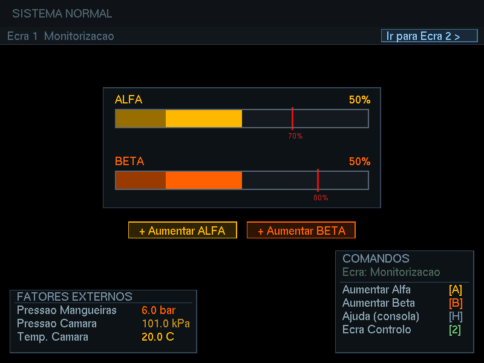
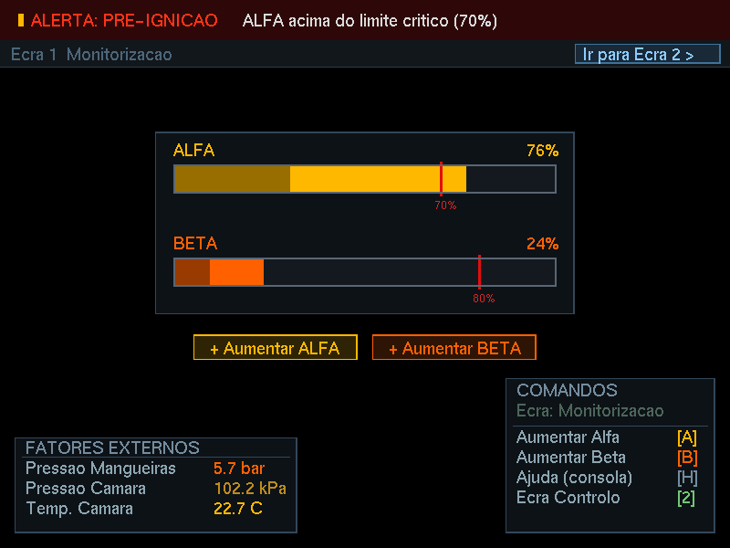
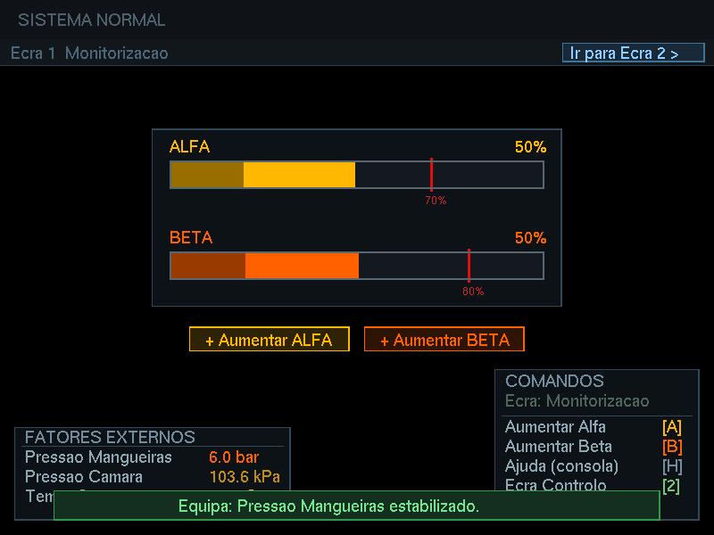
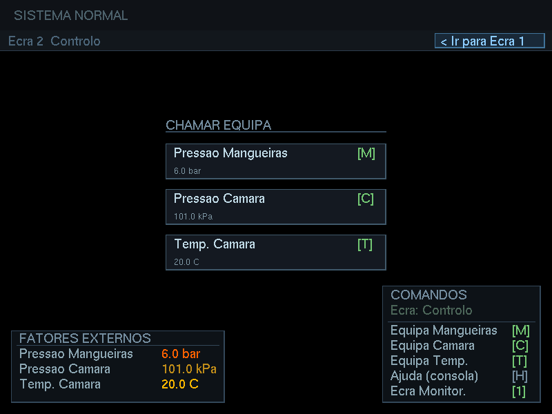
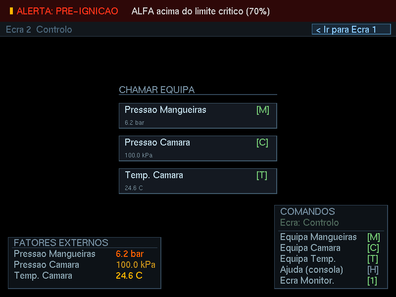
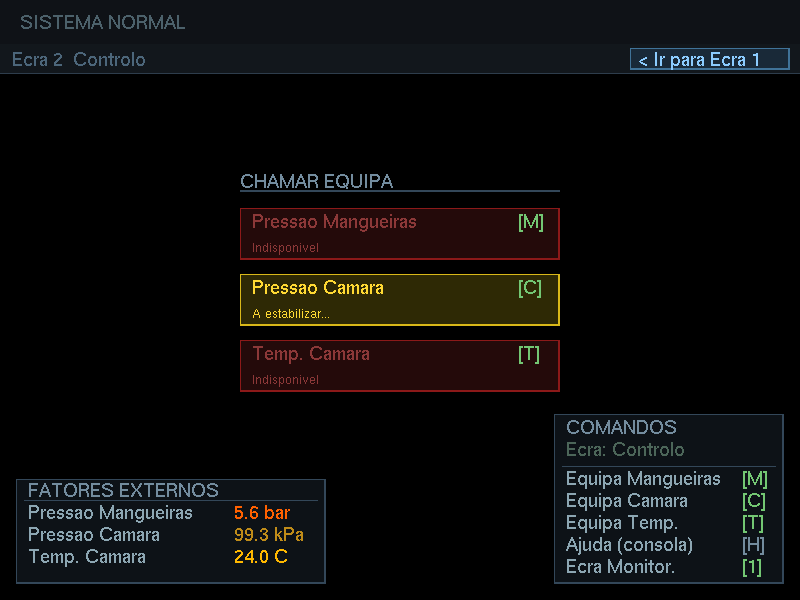

# Space Dilemma

> 🇬🇧 [English version available here](README.md)

Simulação de um sistema de monitorização de uma câmara de mistura de substâncias químicas instáveis numa nave espacial, desenvolvido em C++ com OpenGL/freeglut.

## Contexto

Durante o abastecimento de uma nave espacial, dois componentes químicos instáveis — **Alfa** e **Beta** — são combinados numa câmara de mistura. A sua proporção é influenciada por fatores externos (pressão das mangueiras, pressão da câmara, temperatura) e deve ser constantemente monitorizada por um operador:

- Se **Alfa > 70%**, o sistema entra em **pré-ignição**
- Se **Beta > 80%**, ocorre **corrosão das válvulas**
- Se qualquer substância atingir **100%**, ocorre **falha crítica**

## Funcionalidades

- Barras visuais de Alfa e Beta com limiares de alerta
- Topbar de alertas sempre visível
- Painel de fatores externos com valores em unidades reais (bar, kPa, °C)
- Sistema de fases dos fatores externos (Estável → Deriva → Crítico)
- Dois ecrãs navegáveis:
  - **Ecrã 1** — Monitorização em tempo real com botões clicáveis
  - **Ecrã 2** — Chamada à equipa para estabilizar fatores externos
- Notificação temporária quando a equipa termina uma estabilização
- Sistema de logs em `logs.txt` com timestamp de todos os eventos relevantes

## Screenshots

<details>
<summary><b>Visualizar Ecrã 1</b></summary>
<br>

<p align="center">
  
  
  
</p>
</details>

<details>
<summary><b>Visualizar Ecrã 2</b></summary>
<br>

<p align="center">
  
  
  
</p>
</details>

## Tecnologias

- **C++17**
- **OpenGL** — renderização 2D com projeção ortogonal
- **freeglut** — gestão de janela, teclado, rato e timers

## Compilação

### Linux / macOS

Instalar dependências (Ubuntu/Debian):
```bash
sudo apt install freeglut3-dev
```

Compilar:
```bash
g++ -o space_dilemma main.cpp -lGL -lGLU -lglut
```

### Windows (MinGW)

```bash
g++ -o space_dilemma main.cpp -lfreeglut -lopengl32 -lglu32
```

## Execução

```bash
./space_dilemma
```

O ficheiro `logs.txt` é criado automaticamente na mesma pasta do executável.

### Alternativa com Just

Se tiveres o [just](https://github.com/casey/just) instalado, podes compilar e executar com um único comando:

```bash
just run
```

## Controlos

### Ecrã 1 — Monitorização

| Tecla | Ação |
|---|---|
| `A` | Aumentar Alfa em 5% |
| `B` | Aumentar Beta em 5% |
| `H` | Mostrar estado na consola |
| `2` | Ir para Ecrã 2 |

Os botões de Alfa e Beta também são clicáveis diretamente no ecrã com o rato.

### Ecrã 2 — Controlo

| Tecla | Ação |
|---|---|
| `M` | Chamar equipa para Pressão das Mangueiras |
| `C` | Chamar equipa para Pressão da Câmara |
| `T` | Chamar equipa para Temperatura da Câmara |
| `1` | Voltar para Ecrã 1 |
